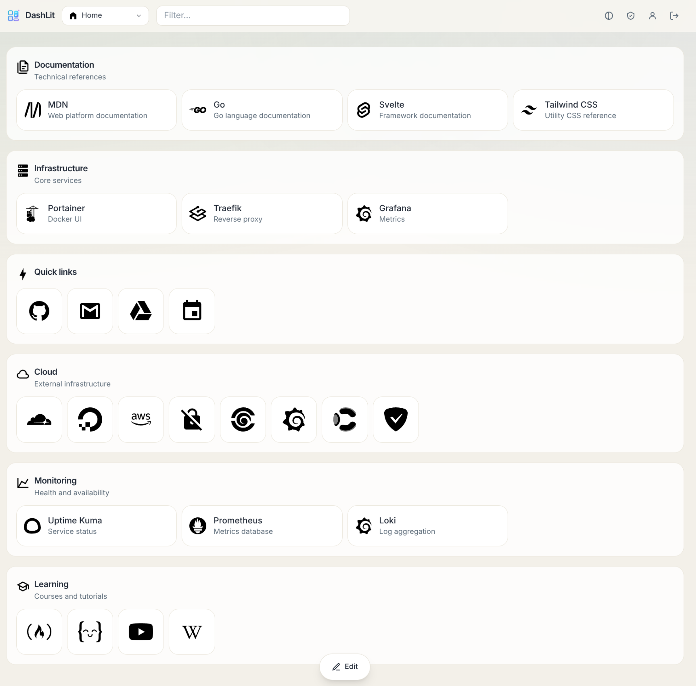
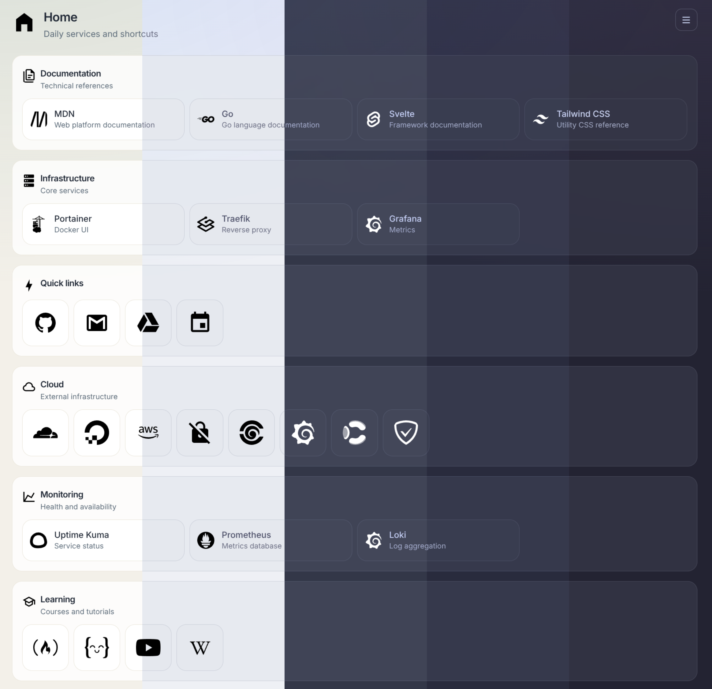

<p align="center">
  
</p>

<h1 align="center">DashLit</h1>

<p align="center">A modern, fast, and self-hosted dashboard for your links and services.</p>

<p align="center">
  <a href="https://github.com/codewec/dashlit/actions/workflows/docker.yml">
    
  </a>
  <a href="https://github.com/codewec/dashlit/releases">
  </a>
  <a href="https://codewec.github.io/dashlit/"></a>
  <a href="https://github.com/codewec/dashlit/discussions"></a>
   <a href="https://catppuccin.com/">
    
  </a>
  <a href="LICENSE"></a>
</p>

> [!TIP]
> **Visit the [DashLit documentation](https://codewec.github.io/dashlit/)** for complete installation and configuration guides, detailed feature descriptions, migration instructions and screenshots.

## Screenshots

<p align="center">
  
  
</p>

## Highlights

- Multiple dashboards with public, authenticated, or private visibility
- Flexible rows, columns, and masonry layouts
- Drag-and-drop groups and items with desktop and touch support
- Per-user default dashboards and a system default dashboard
- URL availability monitoring with live status chips
- Local password authentication and OIDC, including Pocket ID
- User profile and administration pages
- Import, export, and cloning for dashboards, groups, and items
- Built-in icon search across selfh.st/icons and Iconify
- Automatic light/dark icon pairing from selfh.st and light rendering of monochrome Iconify icons on dark themes
- Multiple light and dark Catppuccin-inspired themes
- A single Go binary with the Svelte frontend embedded

## Run with Docker

The beta image is published for `linux/amd64` and `linux/arm64`.

```bash
docker pull ghcr.io/codewec/dashlit:beta
docker run -d \
  --name dashlit \
  --restart unless-stopped \
  -p 3000:8080 \
  -e JWT_SECRET='replace-with-a-long-random-secret' \
  -v dashlit-data:/data \
  ghcr.io/codewec/dashlit:beta
```

Open [http://localhost:3000](http://localhost:3000). The first account created with password authentication becomes an administrator.

### Docker Compose

For production, copy [`.env.example`](.env.example) to `.env`, set at least `JWT_SECRET`, and run:

```bash
docker compose -f docker-compose.yml up -d
```

The production compose file pulls `ghcr.io/codewec/dashlit:beta`. Pin a prerelease by setting `DASHLIT_TAG`, for example:

```dotenv
DASHLIT_TAG=v1.0.0-beta.1
```

To build the image from the current checkout instead:

```bash
docker compose up --build -d
```

Application state, uploaded icons, and the SQLite database are stored under `/data` in the container.

## Migrate from legacy DashLit

Legacy releases stored dashboard data in `dashboard.json`. To migrate, place that file beside the new SQLite database before creating any users. With the standard container paths, the files are:

```text
/data/dashboard.json
/data/bookmarks.db
```

Start DashLit with an empty database. When the login page reports that legacy data was found, enable the import switch and create the first user with a password or OIDC. DashLit converts the legacy groups and links into a private dashboard owned by that first user and selects it as their personal default.

Detection is intentionally performed only at server startup while the users table is empty. If the option does not appear, verify the paths and file permissions, then check the container logs for JSON parsing errors. Back up the legacy directory before migrating and keep the original file until the imported dashboard has been verified.

See the [complete migration guide](https://codewec.github.io/dashlit/guide/migration) for supported fields and troubleshooting.

## Configuration

DashLit reads both process environment variables and a `.env` file. Process environment variables take precedence.

Most container installations only need to set `JWT_SECRET` and, when required, the OIDC options.

| Variable                        | Default             | Description                                            |
| ------------------------------- | ------------------- | ------------------------------------------------------ |
| `JWT_SECRET`                    | Development value   | Signing secret; always replace in production           |
| `DEV_MODE`                      | `false`             | Enable development diagnostics                         |
| `OIDC_ISSUER`                   | Empty               | OIDC issuer URL; leave empty to disable OIDC           |
| `OIDC_CLIENT_ID`                | Empty               | OIDC client ID                                         |
| `OIDC_CLIENT_SECRET`            | Empty               | OIDC client secret                                     |
| `OIDC_REDIRECT_URL`             | Local callback      | Public callback URL                                    |
| `OIDC_BUTTON_TITLE`             | `Sign in with OIDC` | OIDC button label                                      |
| `DISABLE_PASSWORD_REGISTRATION` | `false`             | Disable password registration                          |
| `DISABLE_OIDC_REGISTRATION`     | `false`             | Prevent OIDC from creating new users                   |
| `DISABLE_OIDC_USER_MERGE`       | `false`             | Prevent OIDC identities from linking to existing users |
| `DISABLE_PASSWORD_LOGIN`        | `false`             | Disable password login once OIDC is configured         |

### Advanced runtime settings

The container image already provides appropriate values for these internal settings. Override them only for a custom runtime, filesystem layout, or source installation.

| Variable        | Default                  | Description                                                           |
| --------------- | ------------------------ | --------------------------------------------------------------------- |
| `ADDR`          | `:8080`                  | Internal HTTP listen address                                          |
| `DATA_DIR`      | `./data`                 | Database, uploaded icons, and cache directory; the image uses `/data` |
| `DATABASE_PATH` | `$DATA_DIR/bookmarks.db` | Custom SQLite database path                                           |

When DashLit is behind a reverse proxy, use the external HTTPS address for the callback:

```dotenv
OIDC_REDIRECT_URL=https://dash.example.com/api/auth/oidc/callback
```

Configure the same URL in your OIDC provider. The proxy should forward the original host and protocol headers.

## Development

Requirements: Go 1.25+, Node.js 22+, and pnpm.

```bash
git clone https://github.com/codewec/dashlit.git
cd dashlit
cp .env.example .env

cd frontend && pnpm install && cd ..
make dev-backend
```

In another terminal:

```bash
make dev-frontend
```

The frontend runs at `http://localhost:5173` and proxies API requests to the Go server at `http://localhost:8080`.

The user documentation is a separate VitePress project under `docs/` and does not add Node dependencies to the repository root:

```bash
cd docs
npm install
npm run dev
```

Build the embedded production binary with:

```bash
make build
./app
```

## Releases and changelog

DashLit uses [Conventional Commits](https://www.conventionalcommits.org/) and [git-cliff](https://git-cliff.org/). The Makefile downloads the pinned standalone binary into `./bin` automatically. To install it explicitly or preview pending release notes, run:

```bash
make git-cliff-install
make changelog-preview
```

During beta, releases use prerelease tags such as `v1.0.0-beta.1`. A tag publishes both the versioned container tag and `beta`, and creates a GitHub prerelease. The `latest` container tag is intentionally not published yet.

See [RELEASING.md](RELEASING.md) for the complete maintainer release procedure.

## Data and backups

Stop the container before copying the data volume, or use SQLite's online backup tooling. At minimum, preserve:

- `bookmarks.db`
- `icons/`
- `icon-cache/` (optional; it can be rebuilt)

## License

DashLit is available under the [MIT License](LICENSE).
